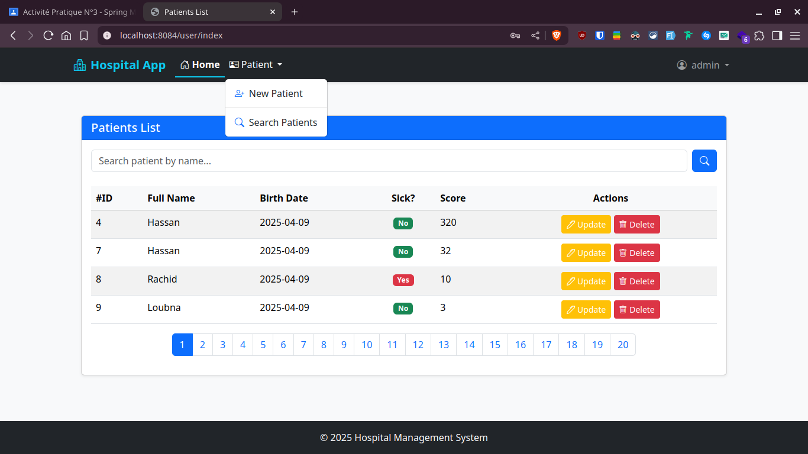
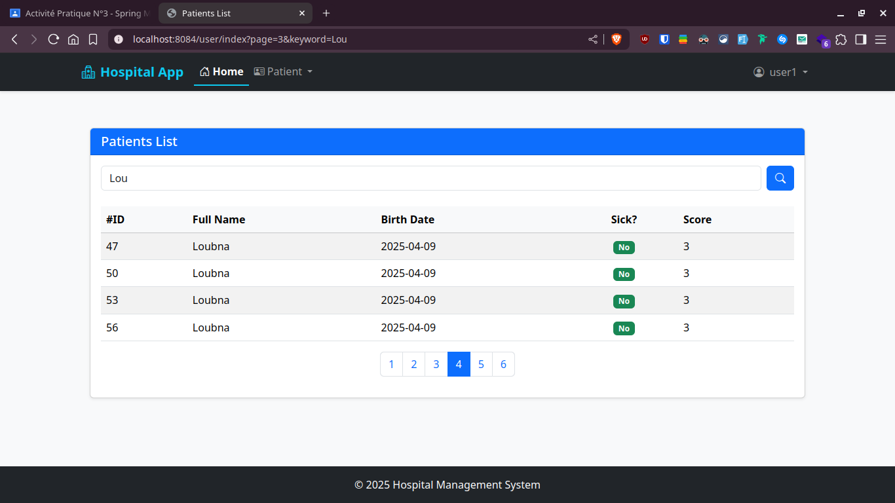
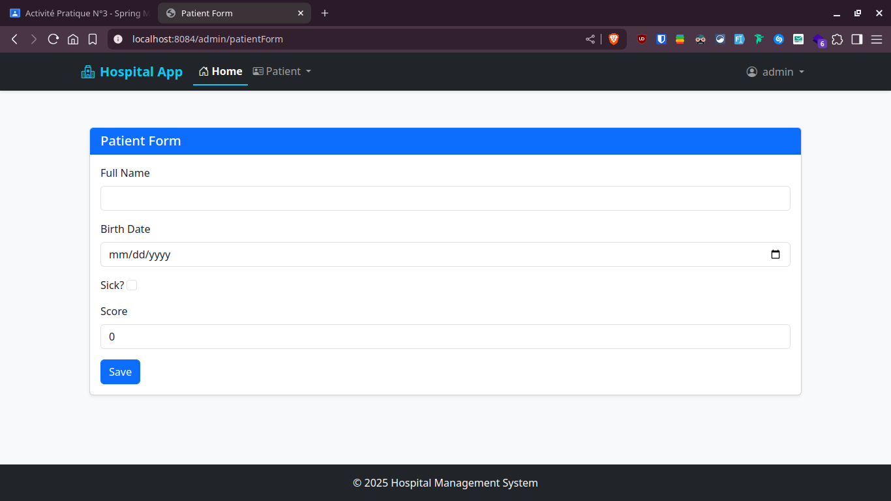
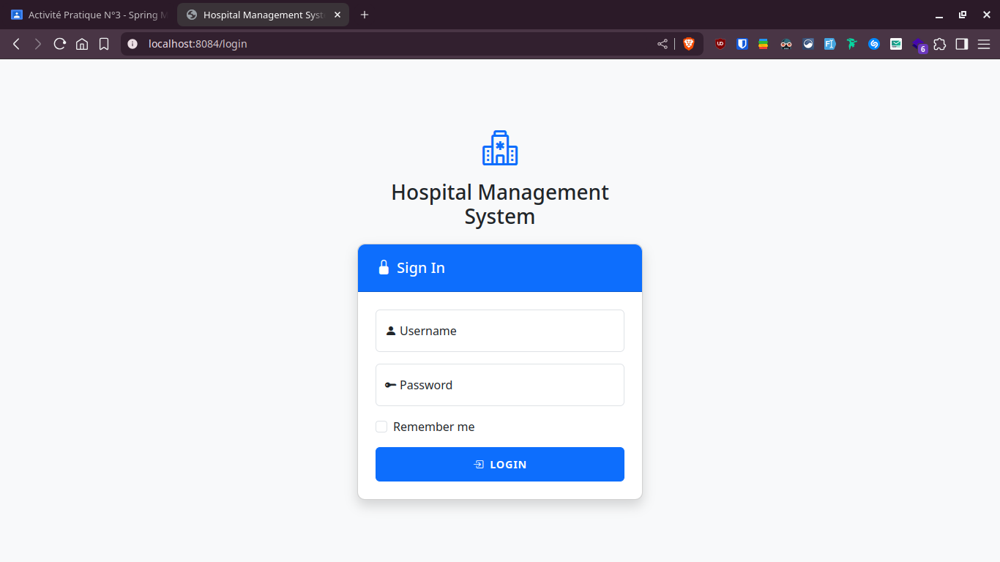

# Système de Gestion Hospitalière
## Application Web avec Spring Boot, Spring MVC, Spring Data JPA et Thymeleaf

## Introduction

Ce rapport présente le développement d'une application web de gestion hospitalière réalisée dans le cadre du laboratoire d'Architecture JEE et Systèmes Distribués. L'objectif principal de ce projet est de mettre en pratique les concepts fondamentaux de Spring Boot, Spring MVC, Spring Data JPA et Thymeleaf pour créer une application web complète avec authentification et autorisation basées sur les rôles.

L'application permet la gestion des patients d'un hôpital avec les fonctionnalités suivantes :
- Authentification des utilisateurs avec différents niveaux d'accès (USER, ADMIN)
- Affichage paginé des patients avec possibilité de recherche
- Ajout, modification et suppression de patients (réservé aux administrateurs)
- Interface utilisateur responsive utilisant Bootstrap

## Table des matières

1. [Structure du projet](#structure-du-projet)
2. [Modèle de données](#modèle-de-données)
3. [Couche d'accès aux données](#couche-daccès-aux-données)
4. [Sécurité et Authentification](#sécurité-et-authentification)
5. [Contrôleurs et Gestion des Requêtes](#contrôleurs-et-gestion-des-requêtes)
6. [Interface Utilisateur avec Thymeleaf](#interface-utilisateur-avec-thymeleaf)
7. [Conclusion](#conclusion)

## Structure du projet

Le projet est structuré selon l'architecture MVC (Modèle-Vue-Contrôleur) en utilisant Spring Boot comme framework principal. Voici l'organisation des packages principaux :

```
ma.enset.hospital
├── entities               // Entités JPA
├── repository             // Interfaces de repositories Spring Data
├── security               // Configuration de sécurité
│   ├── entities           // Entités liées à la sécurité (User, Role)
│   ├── repositories       // Repositories pour les entités de sécurité
│   └── service            // Services de gestion des comptes et authentification
└── web                    // Contrôleurs Spring MVC
```

## Modèle de données

### Entité Patient

L'entité `Patient` représente les informations essentielles d'un patient dans l'hôpital. Elle est définie comme suit :

```java
@Entity
@Getter
@Setter
@NoArgsConstructor
@AllArgsConstructor
@Builder
public class Patient {
    @Id @GeneratedValue(strategy = GenerationType.IDENTITY)
    private Long id;
    @NotEmpty
    @Size(min = 4, max = 40)
    private String name;
    @Temporal(TemporalType.DATE)
    @DateTimeFormat(pattern = "yyyy-MM-dd")
    private Date birthDate;
    private boolean sick;
    @DecimalMin(value = "100")
    private int score;
}
```

Cette classe utilise plusieurs annotations importantes :
- `@Entity` : Indique à JPA que cette classe est une entité persistante
- `@Id` et `@GeneratedValue` : Définissent la clé primaire auto-incrémentée
- Annotations de validation (`@NotEmpty`, `@Size`, `@DecimalMin`) : Permettent de valider les données côté serveur
- `@DateTimeFormat` : Spécifie le format de date pour la conversion entre l'interface utilisateur et le modèle
- Annotations Lombok (`@Getter`, `@Setter`, etc.) : Génèrent automatiquement les getters, setters et autres méthodes utilitaires

### Entités de sécurité

Pour gérer l'authentification et l'autorisation, nous avons défini deux entités principales :

1. **AppUser** : Représente un utilisateur du système
```java
@Entity
@Getter
@Setter
@ToString
@NoArgsConstructor
@AllArgsConstructor
@Builder
public class AppUser {
    @Id
    private String userId;
    @Column(unique = true)
    private String username;
    private String password;
    @Column(unique = true)
    private String email;
    @ManyToMany(fetch = FetchType.EAGER)
    @ToString.Exclude
    List<AppRole> roles;
}
```

2. **AppRole** : Représente un rôle dans le système
```java
@Entity
@Getter
@Setter
@ToString
@NoArgsConstructor
@AllArgsConstructor
@Builder
public class AppRole {
    @Id
    private String role;
}
```

Cette relation many-to-many entre `AppUser` et `AppRole` permet d'assigner plusieurs rôles à un utilisateur, facilitant ainsi la gestion des autorisations.

## Couche d'accès aux données

La couche d'accès aux données utilise Spring Data JPA pour simplifier les opérations de persistance. Les principales interfaces de repository sont :

### PatientRepository

```java
public interface PatientRepository extends JpaRepository<Patient, Long> {
    Page<Patient> findByNameContains(String keyword, Pageable pageable);
}
```

Cette interface étend `JpaRepository` et ajoute une méthode personnalisée `findByNameContains` qui permet de rechercher des patients par nom avec pagination. Spring Data JPA implémente automatiquement cette méthode en se basant sur sa signature.

### Repositories de sécurité

```java
public interface AppUserRepository extends JpaRepository<AppUser, String> {
    AppUser findByUsername(String username);
    AppUser findByEmail(String email);
    AppUser findByUserId(String userId);
}

public interface AppRoleRepository extends JpaRepository<AppRole, String> {
    AppRole findByRole(String role);
}
```

Ces interfaces fournissent des méthodes pour rechercher des utilisateurs et des rôles par différents critères, essentielles pour le processus d'authentification.

## Sécurité et Authentification

La sécurité de l'application est gérée par Spring Security, configuré pour utiliser une authentification basée sur des utilisateurs stockés en base de données.

### Configuration de la sécurité

```java
@Configuration
@EnableWebSecurity
@EnableMethodSecurity()
@AllArgsConstructor
public class SecurityConfig {

    private UserDetailsServiceImpl userDetailsService;

    @Bean
    public SecurityFilterChain securityFilterChain(HttpSecurity httpSecurity) throws Exception {
        return httpSecurity
                .formLogin(
                        form -> form
                                .loginPage("/login")
                                .defaultSuccessUrl("/user/index", true)
                                .permitAll()
                )
                .exceptionHandling(
                        exception -> exception
                                .accessDeniedPage("/notAuthorized")
                )
                .rememberMe(
                        rememberMe -> rememberMe
                                .key("uniqueAndSecret")
                                .tokenValiditySeconds(86400)
                )
                .authorizeHttpRequests(ar -> ar.requestMatchers("/webjars/**").permitAll())
                .authorizeHttpRequests(ar -> ar.anyRequest().authenticated())
                .userDetailsService(userDetailsService)
                .build();
    }
}
```

Cette configuration :
- Utilise une page de login personnalisée (`/login`)
- Configure la page de redirection après connexion réussie (`/user/index`)
- Définit une page personnalisée pour les accès non autorisés (`/notAuthorized`)
- Implémente la fonctionnalité "Remember Me" avec un token valide pendant 24 heures
- Permet l'accès libre aux ressources statiques (webjars)
- Exige l'authentification pour toutes les autres requêtes
- Utilise un `UserDetailsService` personnalisé pour charger les utilisateurs

### Service de gestion des comptes

```java
@Service
@Transactional
@AllArgsConstructor
public class AccountServiceImpl implements AccountService {
    private AppUserRepository userRepository;
    private AppRoleRepository roleRepository;
    private PasswordEncoder passwordEncoder;

    @Override
    public AppUser addNewUser(String username, String password, String email, String confirmPassword) {
        if (userRepository.findByUsername(username) != null) {
            throw new RuntimeException("User already exists");
        }

        if (!password.equals(confirmPassword)) {
            throw new RuntimeException("Password and confirmation do not match");
        }

        if (userRepository.findByEmail(email) != null) {
            throw new RuntimeException("Email already exists");
        }

        if (username == null || password == null || email == null) {
            throw new RuntimeException("Username, password, and email cannot be null");
        }

        AppUser appUser = AppUser.builder()
                .userId(UUID.randomUUID().toString())
                .username(username)
                .password(passwordEncoder.encode(password))
                .email(email)
                .build();

        return userRepository.save(appUser);
    }
    
    // Autres méthodes de gestion des utilisateurs et des rôles...
}
```

Ce service fournit des méthodes pour créer des utilisateurs, ajouter des rôles, et gérer l'attribution des rôles aux utilisateurs. Il utilise `PasswordEncoder` pour hasher les mots de passe avant le stockage en base de données, assurant ainsi la sécurité des informations d'authentification.

### Service d'authentification personnalisé

```java
@Service
@AllArgsConstructor
public class UserDetailsServiceImpl implements UserDetailsService {
    private AccountService accountService;

    @Override
    public UserDetails loadUserByUsername(String username) throws UsernameNotFoundException {
        var appUser = accountService.loadUserByUsername(username);
        if (appUser == null) {
            throw new UsernameNotFoundException(String.format("User %s not found", username));
        }
        return User.
                withUsername(appUser.getUsername())
                .password(appUser.getPassword())
                .roles(
                        appUser.getRoles().stream().map(
                                AppRole::getRole
                        ).toArray(String[]::new)
                )
                .build();
    }
}
```

Cette classe implémente l'interface `UserDetailsService` de Spring Security pour charger les utilisateurs depuis notre base de données personnalisée. Elle convertit notre entité `AppUser` en `UserDetails` standard de Spring Security, en extrayant les rôles et en les formatant correctement.

## Contrôleurs et Gestion des Requêtes

Le principal contrôleur de l'application est `PatientController`, qui gère toutes les opérations liées aux patients.

```java
@Controller
@AllArgsConstructor
public class PatientController {
    private PatientRepository patientRepository;

    @GetMapping(path = "/user/index")
    public String index(
            Model model,
            @RequestParam(name = "page", defaultValue = "0") int page,
            @RequestParam(name = "size", defaultValue = "4") int size,
            @RequestParam(name = "keyword", defaultValue = "") String keyword
    ) {
        Page<Patient> patientsPage = patientRepository.findByNameContains(keyword, PageRequest.of(page, size));
        model.addAttribute("patients", patientsPage.getContent());
        model.addAttribute("pages", new int[patientsPage.getTotalPages()]);
        model.addAttribute("currentPage", page);
        model.addAttribute("keyword", keyword);
        return "patients";
    }
    
    @GetMapping(path = "/admin/delete")
    @PreAuthorize("hasRole('ROLE_ADMIN')")
    public String delete(Long id, String keyword, int page) {
        patientRepository.deleteById(id);
        return "redirect:/user/index?page=" + page + "&keyword=" + keyword;
    }
    
    // Autres méthodes pour créer, modifier des patients...
}
```

Ce contrôleur utilise :
- Les annotations `@GetMapping` et `@PostMapping` pour lier les méthodes aux URLs
- L'annotation `@PreAuthorize` pour restreindre l'accès aux fonctionnalités selon les rôles
- L'objet `Model` pour passer des données aux vues Thymeleaf
- La pagination (`Page<Patient>`, `PageRequest`) pour gérer les grands ensembles de données
- Les redirections pour le comportement POST-Redirect-GET après les soumissions de formulaire

La méthode `index()` est particulièrement importante car elle gère la page d'accueil avec :
- La recherche de patients par nom
- La pagination des résultats
- La transmission des données à la vue



## Interface Utilisateur avec Thymeleaf

Thymeleaf est utilisé comme moteur de template pour créer des vues HTML dynamiques. Un exemple important est la page d'accueil qui liste les patients.

### Template principal

Le template `template1.html` définit la structure commune à toutes les pages :

```html
<!DOCTYPE html>
<html lang="en"
      xmlns:th="http://www.thymeleaf.org"
      xmlns:layout="http://www.ultraq.net.nz/thymeleaf/layout">
<head>
    <!-- Métadonnées et CSS -->
</head>
<body>
<nav class="navbar navbar-expand-lg bg-dark navbar-dark sticky-top">
    <!-- Navigation -->
</nav>

<!-- Main Content -->
<div class="main-content">
    <div class="container">
        <section layout:fragment="content1">
            <!-- Le contenu spécifique sera inséré ici -->
        </section>
    </div>
</div>

<!-- Footer -->
<footer class="footer">
    <!-- Pied de page -->
</footer>

<!-- Scripts -->
</body>
</html>
```

Ce template utilise :
- Thymeleaf Layout Dialect pour la composition de pages
- Bootstrap pour le style responsive
- Des expressions conditionnelles basées sur l'authentification (`th:if="${#authorization.expression('hasRole(''ADMIN'')')}"`)

### Liste des patients

La vue `patients.html` utilise le template principal et ajoute le contenu spécifique :

```html
<div layout:fragment="content1">
    <div class="container py-4">
        <div class="card shadow-sm">
            <div class="card-header bg-primary text-white">
                <h5 class="mb-0">Patients List</h5>
            </div>
            <div class="card-body">
                <!-- Formulaire de recherche -->
                <form class="d-flex mb-4" th:action="@{/user/index}" method="get">
                    <input type="text" class="form-control" th:value="${keyword}" name="keyword"
                           placeholder="Search patient by name...">
                    <button class="btn btn-primary ms-2" type="submit">
                        <i class="bi bi-search"></i>
                    </button>
                </form>

                <!-- Tableau des patients -->
                <div class="table-responsive">
                    <table class="table table-hover table-striped">
                        <!-- En-tête du tableau -->
                        <thead class="table-light">
                        <tr>
                            <th scope="col">#ID</th>
                            <th scope="col">Full Name</th>
                            <th scope="col">Birth Date</th>
                            <th scope="col" class="text-center">Sick?</th>
                            <th scope="col">Score</th>
                            <th scope="col" class="text-center"
                                th:if="${#authorization.expression('hasRole(''ADMIN'')')}">Actions
                            </th>
                        </tr>
                        </thead>
                        <!-- Corps du tableau -->
                        <tbody>
                        <tr th:each="patient : ${patients}">
                            <td th:text="${patient.id}"></td>
                            <td th:text="${patient.name}"></td>
                            <td th:text="${patient.birthDate}"></td>
                            <td class="text-center">
                                <span th:if="${patient.sick}" class="badge bg-danger">Yes</span>
                                <span th:unless="${patient.sick}" class="badge bg-success">No</span>
                            </td>
                            <td th:text="${patient.score}"></td>
                            <td class="text-center" th:if="${#authorization.expression('hasRole(''ADMIN'')')}">
                                <!-- Boutons d'action (modifier, supprimer) -->
                            </td>
                        </tr>
                        </tbody>
                    </table>
                </div>

                <!-- Pagination -->
                <nav aria-label="Page navigation">
                    <ul class="pagination justify-content-center">
                        <li th:each="page, status: ${pages}" class="page-item"
                            th:classappend="${currentPage == status.index} ? 'active' : ''">
                            <a class="page-link"
                               th:href="@{/user/index(page=${status.index}, keyword=${keyword})}"
                               th:text="${status.index + 1}">
                            </a>
                        </li>
                    </ul>
                </nav>
            </div>
        </div>
    </div>
</div>
```

Cette vue illustre plusieurs fonctionnalités de Thymeleaf :
- Itération sur des collections (`th:each`)
- Conditionnels (`th:if`, `th:unless`)
- Attributs dynamiques (`th:href`, `th:classappend`)
- Expressions d'autorisation (`${#authorization.expression()}`)
- Variables d'état dans les boucles (`status.index`)



### Formulaire d'ajout de patient

La vue `patientForm.html` présente un formulaire pour créer un nouveau patient :

```html
<div layout:fragment="content1">
    <div class="container py-4">
        <div class="card shadow-sm">
            <div class="card-header bg-primary text-white">
                <h5 class="mb-0">Patient Form</h5>
            </div>
            <div class="card-body">
                <form th:action="@{/admin/save}" method="post" th:object="${patient}">
                    <div class="mb-3">
                        <label for="name" class="form-label">Full Name</label>
                        <input type="text" id="name" th:field="*{name}" th:value="${patient.name}" class="form-control">
                        <span th:errors="${patient.name}" class="text-danger"></span>
                    </div>
                    <!-- Autres champs du formulaire -->
                    <button type="submit" class="btn btn-primary">Save</button>
                </form>
            </div>
        </div>
    </div>
</div>
```

Ce formulaire utilise :
- L'objet `patient` passé par le contrôleur comme modèle du formulaire (`th:object`)
- Des liaisons de champs pour connecter les entrées HTML aux propriétés du modèle (`th:field`)
- Des affichages d'erreurs pour visualiser les problèmes de validation (`th:errors`)



### Page de login

La page `login.html` est essentielle pour l'authentification :

```html
<div class="login-container">
    <div class="system-logo">
        <i class="bi bi-hospital"></i>
        <h3 class="mt-2">Hospital Management System</h3>
    </div>

    <div class="card">
        <div class="card-header bg-primary text-white">
            <h5 class="mb-0"><i class="bi bi-lock-fill me-2"></i>Sign In</h5>
        </div>
        <div class="card-body p-4">
            <!-- Messages d'erreur -->
            <div th:if="${param.error}" class="alert alert-danger">
                Invalid username or password
            </div>
            
            <!-- Formulaire de login -->
            <form th:action="@{/login}" method="post">
                <div class="form-floating">
                    <input type="text" class="form-control" id="username" name="username"
                           placeholder="Username" required autofocus>
                    <label for="username"><i class="bi bi-person-fill me-1"></i>Username</label>
                </div>
                <!-- Autres champs et boutons -->
            </form>
        </div>
    </div>
</div>
```

Cette page montre :
- L'utilisation de paramètres de requête (`${param.error}`) pour afficher des messages contextuels
- L'intégration avec Spring Security via l'URL d'action standard `/login`
- Une mise en page responsive adaptée à un formulaire d'authentification



## Initialisation des données

L'application initialise des données de test au démarrage grâce aux méthodes annotées avec `@Bean CommandLineRunner` :

```java
@Bean
CommandLineRunner CommandLineRunnerUserDetails(AccountService accountService) {
    return args -> {
        if (accountService.loadRole("USER") == null) {
            accountService.addNewRole("USER");
        }
        if (accountService.loadRole("ADMIN") == null) {
            accountService.addNewRole("ADMIN");
        }
        if (accountService.loadUserByUsername("user1") == null) {
            accountService.addNewUser("user1", "1234", "user1@gmail.com", "1234");
            accountService.addRoleToUser("user1", "USER");
        }

        // Autres utilisateurs...
    };
}
```

Cette approche assure que l'application est immédiatement fonctionnelle après démarrage, avec des utilisateurs et des rôles prédéfinis.

## Conclusion

Ce projet de laboratoire a permis d'implémenter une application web complète de gestion hospitalière utilisant les technologies Spring modernes. Les points clés abordés comprennent :

1. La mise en place d'une architecture MVC avec Spring Boot
2. L'utilisation de Spring Data JPA pour simplifier l'accès aux données
3. L'implémentation d'un système d'authentification et d'autorisation avec Spring Security
4. La création d'interfaces dynamiques avec Thymeleaf et Bootstrap
5. La gestion de fonctionnalités avancées comme la pagination et la recherche

Cette application démontre l'efficacité de l'écosystème Spring pour développer des applications web robustes et sécurisées. Les patterns de conception utilisés (Repository, Service, MVC) favorisent la séparation des responsabilités et facilitent la maintenance du code.

Les perspectives d'amélioration pourraient inclure l'ajout de fonctionnalités comme la gestion des rendez-vous, l'intégration avec d'autres systèmes hospitaliers via des API REST, ou l'implémentation d'un système de notification pour les patients et le personnel médical.
